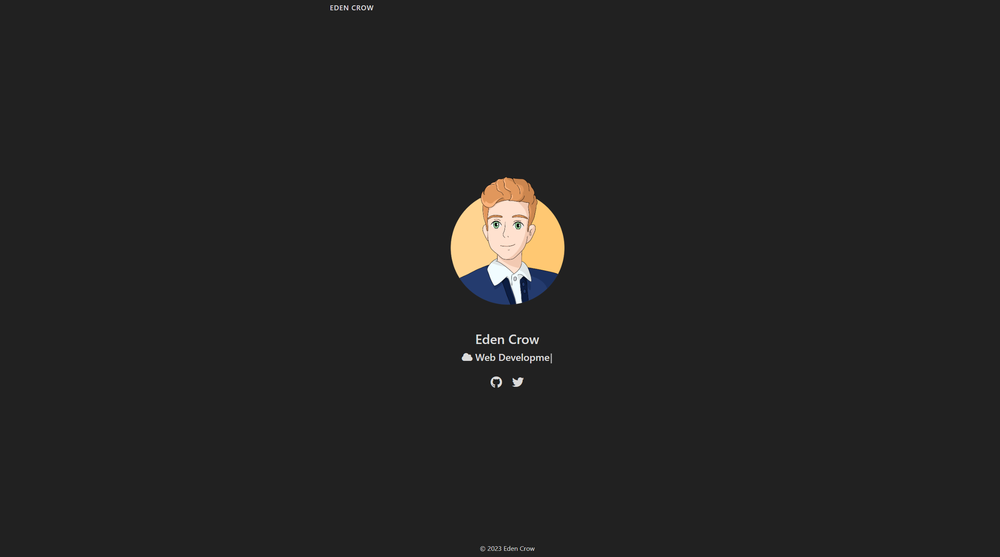

  
  <h1 align="center">EdenCrow.info</h1>

*The repository for my personal homepage.*

Table of Contents

1. [About](#about)
2. [Development](#dev)
    - [Prerequisites](#devPrereq)
    - [Download](#devDownload)
    - [Serving locally](#devLocal)
3. [Roadmap](#map)
4. [Licenses](#license)
4. [Acknowledgements](#acknowledgements)
    - [README support](#ackReadme)

## :raised_eyebrow: About

This repository contains the source code for my personal website [EdenCrow.info](https://edencrow.info).

The site is created with the use of:
- **[NodeJS](https://nodejs.org/)**: Javascript runtime environment
- **[npm](https://npmjs.org/)**: package management
- **[Hugo](https://gohugo.io/) (via [hugo-bin](https://www.npmjs.com/package/hugo-bin))**: static site generation
- **[hugo-coder](https://github.com/luizdepra/hugo-coder)**: site theme
- **[Webpack](https://webpack.js.org/)**: module bundling
- and a small selection of other npm packages

It is automatically deployed to [GitHub Pages](https://pages.github.com/) via [GitHub Actions](https://github.com/features/actions).

Each section (eg. the homepage) is being developed one at a time, and will be pushed live once complete.

## :wrench: Development

### Prerequisites
- [NodeJS](https://nodejs.org/)
- [npm](https://npmjs.org/)

### Download
1) Clone this repository
2) Run `npm install` to install dependencies

### Serving locally
1) Run `npm run serve`
2) The site will be accessible at http://localhost:1313/ and saved changes will automatically rebuild
3) Terminate the process when finished
4) Run `npm run clean` to clean folder structure

## :dart: Roadmap

To see the roadmap for this project, please check [the relevant wiki page](https://github.com/EdenCrow/edencrow.github.com/wiki/%F0%9F%8E%AF-Roadmap).

## :scroll: Licenses
Original code for this project is licensed under the [MIT](https://opensource.org/licenses/MIT) license.

Blog content posted to the site is licensed under [CC BY 4.0](https://creativecommons.org/licenses/by/4.0/).

## :star: Acknowledgements

### README support
- [Shields](https://github.com/badges/shields)
- [Badges4-README.md-Profile](https://github.com/alexandresanlim/Badges4-README.md-Profile)
- [emoji-cheat-sheet](https://github.com/ikatyang/emoji-cheat-sheet)
